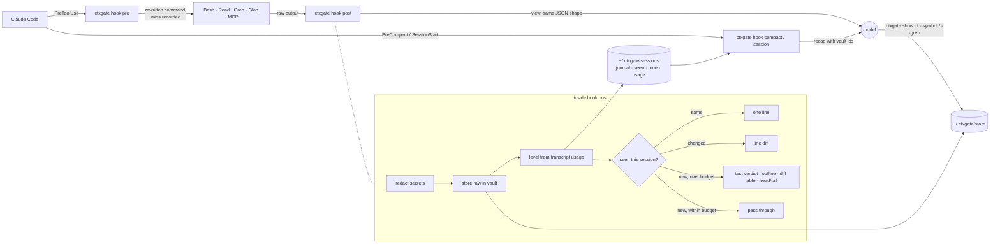
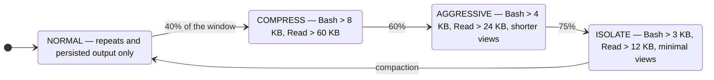

# ctxgate

A context firewall for Claude Code. It sits in the tool hooks, keeps every raw tool output in
a local vault, and decides how much of it the model gets to see.

[日本語](README_ja.md) · [Changelog](CHANGELOG.md)

## What it does

1. **Nothing, while the window has room.** The model sees tool outputs exactly as it would
   without ctxgate. Measured: identical token counts, identical answers.
2. **Squeezes, once the window is 40% full.** Big Bash outputs, big Reads and `git diff`s are
   replaced by a short view (test verdicts, symbol outlines, file tables) and the raw text
   stays in the vault under an id. Measured on Sonnet: 16–22% fewer input tokens on long
   tasks, no change in success rate.
3. **Never squeezes a search.** Grep and Glob results are what the model is looking for; hiding
   a match only makes it search again.

Always on, at every level:

- **Repeats** — reading an unchanged file or re-running the same command costs one line.
- **Oversized output** — what Claude Code itself would cut to 2 KB becomes a real summary.
- **Recall after compaction** — a timeline of what was seen, with vault ids, is handed back.
- **Secrets** — credential-shaped strings are masked before they reach the model.
- **Report** — `ctxgate report` shows what fills the window: tool output, harness
  attachments, your own edits. Only the first is ctxgate's to shrink.

## What the model sees

When squeezed, a 12 KB `cargo test` becomes:

```
[ctxgate] cargo test output: 403 lines / 12 KB → vaulted as ctx:9258de38065e (NOT in context).
  full text: ctxgate show 9258de38065e [--grep RE | --around RE N | --lines A-B | --tail N]
cargo test: FAILED — 238 passed, 3 failed, 0 ignored
failed:
  parser::match_nested
  wasm::rc_release
── parser::match_nested ──
  thread 'parser::match_nested' panicked at src/parser.rs:412:9:
  assertion `left == right` failed
```

A 4,720-line Rust file becomes a table of contents, and one symbol can be fetched by name:

```
[ctxgate] Read src/cmds/git/git.rs: 4720 lines, rust, 231 symbols → vaulted as ctx:b0c8c343b22f
  enum    GitCommand                     L20-34
  fn      run_diff                       L112-216
  fn      compact_diff                   L648-821
  …
  mod     tests                          L2657-4720   (147 test symbols collapsed)
```

```bash
ctxgate show b0c8c343b22f --symbol run_diff
```

A second Read of an unchanged file, at any level:

```
[ctxgate] Read src/config.almd: unchanged since you last saw it this session (76 lines / 3 KB, ctx:4826ab3f8d38).
```

## Install

```bash
almide install github.com/O6lvl4/ctxgate        # one native binary → ~/.local/bin/ctxgate
cd your-project && ctxgate init                 # hooks into .claude/settings.json + a CLAUDE.md note
```

Restart Claude Code (or run `/hooks`). `ctxgate doctor` checks the setup.

Optional:

```bash
# symbol outlines for Rust / Go / TypeScript / Python (Almide is built in)
git clone https://github.com/O6lvl4/ctxgate && cd ctxgate/tools/ctxgate-outline
cargo build --release && cp target/release/ctxgate-outline ~/.local/bin/

# rtk: Bash commands are rewritten through `rtk rewrite` when it is installed
brew install rtk
```

## What to expect

Measured with `bench/bench.almd`: the same tasks through `claude -p` with and without
ctxgate, fresh clone per run, real usage from the JSON result. Sonnet, 3 runs per mode.

| Situation | Input tokens | Success |
|---|---|---|
| 5 short tasks, default settings | same as without (±noise) | 15/15 both |
| `git diff` review, window squeezed | **−16%** | 3/3 both |
| `.unwrap()` audit across a repo, window squeezed | **−22%** | 3/3 both |

Two things the numbers taught us, and why the defaults are what they are:

- **A summary that makes the model ask again loses.** Every extra turn re-sends the whole
  window. The first defaults (squeeze from the first turn) were 13% *worse* than no ctxgate
  because the model paged through outlines it needed in full. Hence: do nothing while roomy.
- **Byte counts are not token counts.** Tools that report "40% saved" count the bytes they
  touched. The model routes around them (`git diff --no-compact`, a second Read) and the
  window ends up the same size. Measure the bill, not the output.

Only Sonnet is measured. Run it yourself:

```bash
almide run bench/bench.almd -- --repo <clone> --runs 3 --model sonnet
```

## Commands

```
ctxgate show <id> [--grep RE] [--around RE N] [--lines A-B] [--head N] [--tail N] [--symbol NAME]
ctxgate recall [N]                 files read + timeline of replaced outputs (after a compaction)
ctxgate report                     replacements, misses, and what fills the window
ctxgate status                     context usage and level of the current session
ctxgate list [N] · stats · gc      the vault
ctxgate outline <file>             symbol table
ctxgate summarize "<command>"      stdin → the view the hook would produce
ctxgate init [--global] · doctor   setup
ctxgate statusline                 status-line segment (pipe Claude Code's status JSON in)
```

Ids may be shortened to a unique prefix.

## Configuration

Environment variables, no config file. The ones that matter:

| Variable | Default | |
|---|---|---|
| `CTXGATE_LVL_COMPRESS` / `_AGGRESSIVE` / `_ISOLATE` | 40 / 60 / 75 | % of the window at which each level starts |
| `CTXGATE_WINDOW` | auto | window in tokens (1M when the model has `[1m]`, else 200k) |
| `CTXGATE_MAX_BASH` / `_READ` | 30000 / 1000000 | bytes before a Bash / Read output is replaced at NORMAL; levels lower them to 8k/60k, 4k/24k, 3k/12k |
| `CTXGATE_REDACT` | 1 | mask secrets (0 disables) |
| `CTXGATE_RETAIN_DAYS` | 14 | vault retention (0 keeps forever) |
| `CTXGATE_RTK` | 1 | rtk delegation (0 disables) |
| `CTXGATE_HOME` | `~/.ctxgate` | vault location |

Also: `CTXGATE_HEAD` / `_TAIL` (30), `_SALIENT` (40), `_LINE_CLIP` (200), `_MAX_BLOCK` (20),
`_OUTLINE_MAX` (120), `_DEDUP_MIN` (600), `_MAX_GREP` / `_MAX_OTHER` (30000).

## Architecture



Levels, driven by how full the window is:



Grep and Glob are outside the levels entirely. A kind of replacement that keeps making the
model ask again (a *miss*) is softened for the rest of the session, whatever the level.

## Hooks

- **PreToolUse** hands Bash commands to rtk when present, and notes when a call is the model
  going back for something a summary withheld (a *miss*). Kinds that keep missing are softened
  for the rest of the session.
- **PostToolUse** stores the raw output in `~/.ctxgate/store` (content-addressed), reads the
  current context size from the session transcript, picks the level, and returns a view in the
  same JSON shape the tool produced.
- **PreCompact / SessionStart** reset the repeat memory and hand the recap back after a
  compaction.

Views: `cargo test` / `go test` / `pytest` / `vitest` / `jest` / `tsc` verdicts; `git diff` /
`show` / `log` / `status`; symbol outlines via tree-sitter; grouped Grep and Glob trees; and a
generic head / tail / error-lines view. Hook overhead is 20–70 ms.

Written in [Almide](https://github.com/almide/almide). Dual-licensed MIT / Apache-2.0.
