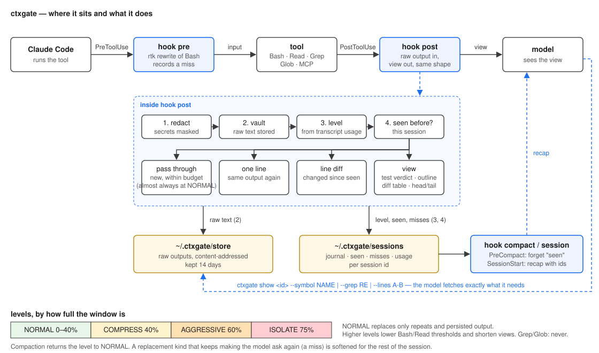

# ctxgate

Claude Code のためのコンテキスト・ファイアウォールです。ツール呼び出しの hook として動き、
ツールの生出力をすべてローカルの vault に保存したうえで、モデルにどこまで見せるかを決めます。

[English](README.md) · [Changelog](CHANGELOG.md)

## 何をするか

1. **コンテキストウィンドウに余裕があるうちは、何もしません。** モデルには ctxgate なしのときと
   同じ出力が届きます。計測でも、トークン数・回答ともに差はありませんでした。
2. **ウィンドウが 40% を超えたら、絞ります。** 大きな Bash 出力、大きな Read、`git diff` を
   短い表示（テスト結果の要約、シンボル一覧、変更ファイルの表）に置き換え、元の本文は id 付きで
   vault に残します。Sonnet での計測では、長いタスクで入力トークンが 16〜22% 減り、成功率は
   変わりませんでした。
3. **検索結果は絞りません。** Grep / Glob の結果は、モデルがまさに探しているものです。
   隠しても、もう一度検索されるだけです。

レベルに関係なく、常に働くもの:

- **繰り返しの検出** — 変更のないファイルの再 Read や、同じコマンドの再実行は 1 行に縮みます。
- **巨大な出力の救済** — Claude Code が先頭 2 KB に切り詰めてしまう出力を、中身のある要約にします。
- **compaction 後の recall** — それまでに見たものの時系列を、vault の id 付きでモデルに返します。
- **秘密情報のマスク** — 認証情報らしき文字列は、モデルに届く前に伏せます。
- **report** — `ctxgate report` が、ウィンドウを占めているものの内訳を出します。ツール出力、
  ハーネスが添付するもの、自分の編集。このうち ctxgate が縮められるのはツール出力だけです。

## モデルに届くもの

絞っているとき、12 KB の `cargo test` の出力はこうなります:

```
[ctxgate] cargo test output: 403 lines / 12 KB → vaulted as ctx:9258de38065e (NOT in context).
  full text: ctxgate show 9258de38065e [--grep RE | --around RE N | --lines A-B | --tail N]
cargo test: FAILED — 238 passed, 3 failed, 0 ignored
failed:
  parser::match_nested
  wasm::rc_release
── parser::match_nested ──
  thread 'parser::match_nested' panicked at src/parser.rs:412:9:
  assertion `left == right` failed
```

4,720 行の Rust ファイルはシンボル一覧になり、必要な 1 つを名前で取り出せます:

```
[ctxgate] Read src/cmds/git/git.rs: 4720 lines, rust, 231 symbols → vaulted as ctx:b0c8c343b22f
  enum    GitCommand                     L20-34
  fn      run_diff                       L112-216
  fn      compact_diff                   L648-821
  …
  mod     tests                          L2657-4720   (147 test symbols collapsed)
```

```bash
ctxgate show b0c8c343b22f --symbol run_diff
```

変更のないファイルを 2 回目に Read したときは、どのレベルでもこの 1 行です:

```
[ctxgate] Read src/config.almd: unchanged since you last saw it this session (76 lines / 3 KB, ctx:4826ab3f8d38).
```

## インストール

```bash
almide install github.com/O6lvl4/ctxgate        # ネイティブバイナリが 1 つ → ~/.local/bin/ctxgate
cd your-project && ctxgate init                 # .claude/settings.json に hook を登録し、CLAUDE.md に案内を追記
```

Claude Code を再起動するか `/hooks` を実行してください。`ctxgate doctor` で設定を確認できます。

任意で:

```bash
# tree-sitter によるシンボル一覧: Rust, Go, TypeScript/TSX, Python, C, C++, Java, Ruby, C#, PHP, Bash, Lua, Kotlin, Swift, Scala（Almide は内蔵）
git clone https://github.com/O6lvl4/ctxgate && cd ctxgate/tools/ctxgate-outline
cargo build --release && cp target/release/ctxgate-outline ~/.local/bin/

# rtk が入っていれば、Bash コマンドは `rtk rewrite` を通してから実行されます
brew install rtk
```

## 期待できる効果

`bench/bench.almd` で計測しています。同じタスクを ctxgate あり / なしで `claude -p` に流し、
実行のたびに新しい clone を使い、JSON 結果から実際の usage を読みます。Sonnet、各モード 3 回。

| 状況 | 入力トークン | 成功 |
|---|---|---|
| 短いタスク 5 つ、既定設定 | なしと同じ（ばらつきの範囲内） | 両方 15/15 |
| `git diff` のレビュー、ウィンドウが詰まった状態 | **−16%** | 両方 3/3 |
| リポジトリ全体の `.unwrap()` 監査、ウィンドウが詰まった状態 | **−22%** | 両方 3/3 |

この数字から分かったことが 2 つあり、既定値はそれに従っています。

- **モデルに聞き直させる要約は損をします。** ターンが 1 つ増えるたびに、ウィンドウ全体が
  もう一度送られるからです。最初の既定値（最初から絞る）は ctxgate なしより 13% *悪く*なりました。
  丸ごと必要だったファイルをシンボル一覧に置き換えたため、モデルがページ送りで読み直したのです。
  だから、余裕があるうちは何もしません。
- **バイト数とトークン数は別物です。** 「40% 節約」と表示するツールは、自分が処理した出力の
  バイト数を数えています。モデルは回り道をして（`git diff --no-compact` を叩く、もう一度 Read する）
  結局同じ大きさのウィンドウになります。測るべきは出力の大きさではなく、実際の請求額です。

計測は Sonnet のみです。自分で回すには:

```bash
almide run bench/bench.almd -- --repo <clone> --runs 3 --model sonnet
```

## コマンド

```
ctxgate show <id> [--grep RE] [--around RE N] [--lines A-B] [--head N] [--tail N] [--symbol NAME]
                                   vault から必要な部分だけ取り出す
ctxgate recall [N]                 このセッションで読んだファイルと、置き換えた出力の時系列（compaction 後に使う）
ctxgate report                     置き換えた回数、モデルが取りに戻った回数、ウィンドウを占めているものの内訳
ctxgate status                     現在のコンテキスト使用率とレベル
ctxgate list [N]                   vault の最近のエントリ
ctxgate stats                      保存したバイト数と見せたバイト数の累計
ctxgate gc [--days N]              古いエントリを削除
ctxgate outline <file>             ソースファイルのシンボル一覧
ctxgate summarize "<command>"      stdin の内容を、hook が作るのと同じ形に要約して表示
ctxgate init [--global]            hook を登録する
ctxgate doctor                     インストール状態の確認
ctxgate statusline                 ステータスライン用の 1 区画（Claude Code の status JSON を stdin に渡す）
```

id は、他と区別できる長さまで省略できます。

## 設定

環境変数のみで、設定ファイルはありません。主なもの:

| 変数 | 既定値 | |
|---|---|---|
| `CTXGATE_LVL_COMPRESS` / `_AGGRESSIVE` / `_ISOLATE` | 40 / 60 / 75 | 各レベルに入るウィンドウ使用率（%） |
| `CTXGATE_WINDOW` | auto | ウィンドウのトークン数（モデル名に `[1m]` があれば 1M、なければ 200k） |
| `CTXGATE_MAX_BASH` / `_READ` | 30000 / 1000000 | NORMAL で Bash / Read の出力を置き換え始めるバイト数。レベルが上がると 8k/60k → 4k/24k → 3k/12k に下がる |
| `CTXGATE_REDACT` | 1 | 秘密情報のマスク（0 で無効） |
| `CTXGATE_RETAIN_DAYS` | 14 | vault の保持日数（0 で無期限） |
| `CTXGATE_RTK` | 1 | rtk への委譲（0 で無効） |
| `CTXGATE_HOME` | `~/.ctxgate` | vault の置き場所 |

そのほか: `CTXGATE_HEAD` / `_TAIL`（30）、`_SALIENT`（40）、`_LINE_CLIP`（200）、`_MAX_BLOCK`（20）、
`_OUTLINE_MAX`（120）、`_DEDUP_MIN`（600）、`_MAX_GREP` / `_MAX_OTHER`（30000）。

## アーキテクチャ



上段は、ツール呼び出し 1 回の流れです。hook post の中では、マスク → vault に保存 → transcript から
レベルを決定 → このセッションで見たかを判定、の順に進み、そのまま通す / 1 行 / 行単位の差分 /
要約表示、のいずれかになります。モデルは `ctxgate show` で、vault から必要な部分だけを取り出せます。
下段は、ウィンドウの使用率で決まるレベルです。Grep と Glob はレベルの対象外です。モデルに
聞き直させ続ける種類の置き換え（*miss*）は、レベルに関係なく、そのセッションの残りでは緩めます。

## 各 hook の役割

- **PreToolUse** — rtk があれば Bash コマンドを渡して書き換えます。要約で隠されたものをモデルが
  取りに戻った呼び出し（*miss*）を記録し、miss が続く種類の置き換えはそのセッションの残りで緩めます。
- **PostToolUse** — 生の出力を `~/.ctxgate/store` に保存し（内容のハッシュで管理）、セッションの
  transcript から現在のコンテキスト量を読んでレベルを決め、ツールが返したのと同じ JSON の形で
  表示を返します。
- **PreCompact / SessionStart** — 繰り返し検出の記憶をリセットし、compaction 後に recap を渡します。

表示の種類: `cargo test` / `go test` / `pytest` / `vitest` / `jest` / `tsc` の結果、`git diff` /
`show` / `log` / `status`、tree-sitter によるシンボル一覧、Grep のファイル別まとめ、Glob のツリー表示、
汎用の先頭 / 末尾 / エラー行。hook のオーバーヘッドは 1 回あたり 20〜70 ms です。

[Almide](https://github.com/almide/almide) 製。MIT / Apache-2.0 のデュアルライセンス。
